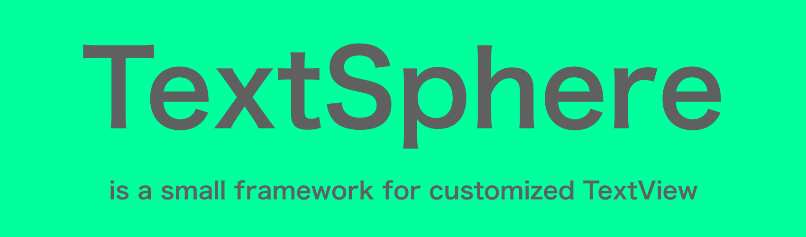
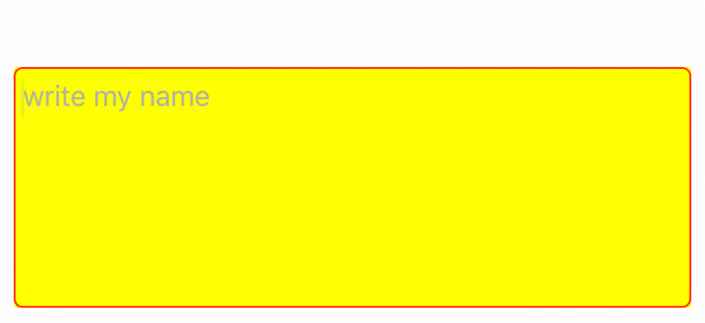

## Sneak Peek

### Features
- [x] Placeholder text
- [x] TextView Over Placeholder text
- [x] Placeholder transition animation
- [x] Configurable textview character limit
- [x] Changeable Font
- [x] Built-in TextView shake animation
- [x] Built-in Taptic engine trigger
  - [x] available(iOS 10.0, and greater)
- [x] Built-in Vibrations
  - [x] available(iOS 9.0, and lower)

### Requirements
- iOS 9.0
- Swift 4.2
- XCode 10

### Installation

#### CocoaPods

`pod 'TextSphere'`

### Manually Installation
Copy TextSphere.swift file to your project directory

### Usage
You must first create a view and define its class as TextSphere. Then you can customize UIView's background color, corner radius, etc.

TextSphere contains the following customizations presents.

### Public customizable properties
| property        | what do         | related property       
| :------------- |:-------------|:-------------|
| placeholderText      | textview for placeholder text | placeholderColor, placeholderTextFont
| placeholderTextFont| TextView text font
| upperText      | TextView over text      | upperTextColor, upperTextFont
| upperTextFont | TextView overt text font
| textColor | TextView text color      |
| textFont | TextView font, *default* used by systemFont

### Release History

### Credits
Çağrı ÇOLAK ([@cgcolak](https://twitter.com/cgcolak))
### License
TextSphere is released under the MIT license. See LICENSE for details.
